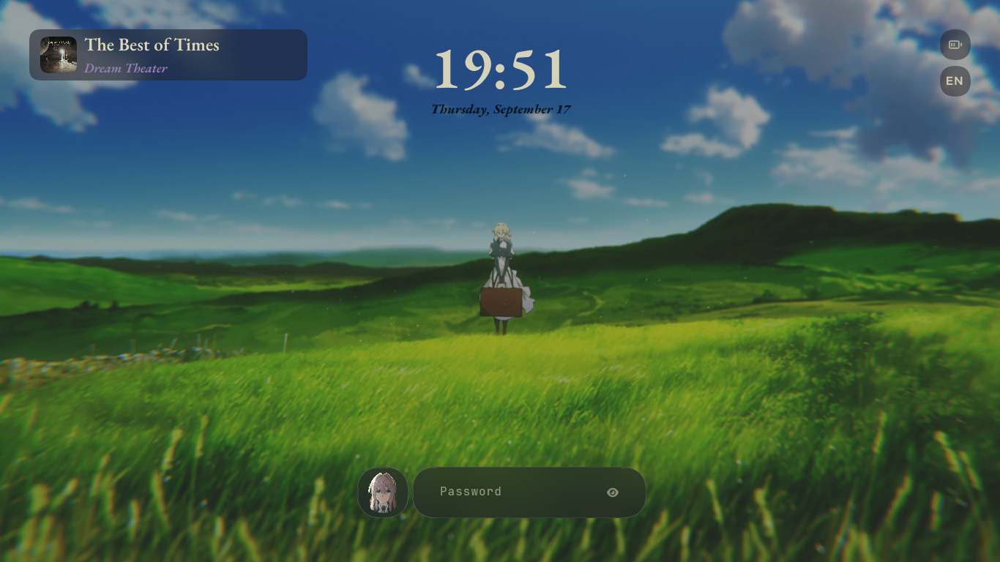

# Violet Rice 💜

A *Violet Evergarden* rice for Artix Linux (works on Arch too, and probably other distros), running on MangoWM (Wayland).

---
<p align="center">
  
</p>

---

## About

This rice mixes the soft, elegant colors of *Violet Evergarden* with the warm tones of the Kanagawa Wave palette. The same colors and fonts follow you everywhere — boot menu, login screen, lock screen, terminal, bar, and notifications.

It runs on **dinit**, not systemd, and the whole thing is smooth on a 2012 laptop.

---

## Highlights

- 🎨 **One palette, everywhere** — the same colors and fonts follow you from GRUB all the way to the notification popups.
- 🚀 **Custom GRUB theme** — a full landscape background with styled menu entries, not just a wallpaper swap.
- 💻 **Custom Starship prompt** — a hand-picked gradient that flows from teal, to sky blue, to violet, to pink.
- 🔑 **Veila lock screen** — clock, date, and a now-playing panel that only appears when music is playing.
- 📄 **Keybinds cheat sheet** — hit `Alt + Menu` and every keybind shows up in Rofi. No more grepping your own config.
- 🔓 **Transparent wlogout** — the power menu shows the wallpaper through it instead of a flat background.
- 🎵 **Cava visualizer** — the audio bars use the same gradient as the rest of the rice.
- 🪫 **Runs on old hardware** — smooth on a 2012 Lenovo G480 (Intel i5-3320M, 8GB RAM, SSD, 1366x768).

---

## Screenshots

<details>
<summary>🏡 Home</summary>

</details>

<details>
<summary>👣 Foot</summary>

</details>

<details>
<summary>💌 Menu</summary>
<br>

**📬 Rofi**
<br>


---
**🛜 Wifi**
<br>


---
**📄 Keybinds Cheat Sheet**
<br>

</details>

<details>
<summary>🔐 SDDM Login</summary>

</details>

<details>
<summary>💘 GRUB Boot Menu</summary>

</details>

<details>
<summary>⚡ Power Menu</summary>

</details>

<details>
<summary>🔑 Lock Screen</summary>

</details>

<details>
<summary>🔔 Mako Notifications</summary>

</details>

---

## Specs

|                         |                                       |
| :---                    | :---                                  |
| **OS**                  | Artix Linux                           |
| **Init**                | dinit                                 |
| **Window Manager**      | MangoWM (Wayland)                     |
| **Bar**                 | Waybar                                |
| **Terminal**            | Foot                                  |
| **Shell Prompt**        | Starship                              |
| **App Launcher**        | Rofi                                  |
| **Notification Daemon** | Mako                                  |
| **Display Manager**     | SDDM                                  |
| **Lock Screen**         | Veila                                 |
| **Visualizer**          | Cava                                  |
| **Fonts**               | JetBrainsMono Nerd Font, EB Garamond  |
| **Resolution**          | 1366x768                              |

---

## Installation

There's no install script yet, so this is manual. Do the steps in order — services before themes, themes before reboot.

> **Heads up:** this targets **Artix + dinit**. On systemd distros everything still works, but skip step 3 and enable the equivalent systemd units instead.

### 1. Required packages

These are what the rice actually needs. Leave any of these out and something visibly breaks.

```bash
# --- Core rice ---
sudo pacman -S --needed waybar foot rofi mako sddm sddm-dinit starship \
  swaybg cava fastfetch wlogout grub efibootmgr

# --- Wayland utilities (keybinds & scripts depend on these) ---
sudo pacman -S --needed grim slurp brightnessctl playerctl pamixer \
  wl-clipboard cliphist wl-clip-persist wlr-randr swayidle \
  xdg-desktop-portal-wlr polkit-gnome imagemagick jq

# --- Audio ---
sudo pacman -S --needed pipewire pipewire-alsa pipewire-pulse wireplumber \
  pipewire-dinit pipewire-pulse-dinit wireplumber-dinit \
  pavucontrol alsa-utils sof-firmware

# --- Network ---
sudo pacman -S --needed networkmanager networkmanager-dinit \
  network-manager-applet nm-connection-editor

# --- Session / seat management (Artix) ---
sudo pacman -S --needed elogind-dinit dbus-dinit-user turnstile turnstile-dinit

# --- Files & archives ---
sudo pacman -S --needed thunar tumbler gvfs udiskie udisks2 xarchiver \
  unzip zip unrar 7zip ntfs-3g exfatprogs

# --- GTK / Qt theming ---
sudo pacman -S --needed adwaita-dark papirus-icon-theme nwg-look xsettingsd \
  qt5-base qt5-svg qt5-tools

# --- Fonts (icons and the serif headings both depend on these) ---
sudo pacman -S --needed ttf-jetbrains-mono-nerd ebgaramond-otf \
  noto-fonts noto-fonts-cjk noto-fonts-emoji noto-fonts-extra \
  ttf-dejavu ttf-liberation
```

From the AUR (`paru` or `yay`):

```bash
paru -S --needed mangowm-git veila-bin networkmanager-dmenu-git \
  rofi-emoji-git ttf-google-fonts-typewolf
```

`veila-bin` is the lock screen and `networkmanager-dmenu-git` powers the Rofi wifi menu in the screenshots — the rice expects both.

*Package names vary between repos and over time — check before you install.*

### 2. Copy the config

This mirrors your real `~/.config/`, so one copy handles the WM, bar, terminal, launcher, prompt, notifications, and lock theme:

```bash
cp -r .config/. ~/.config/
```

Then make the scripts executable — they won't run otherwise:

```bash
chmod +x ~/.config/rofi/scripts/*.sh
chmod +x ~/.config/waybar/scripts/*.sh
chmod +x ~/.config/mango/scripts/*.sh
chmod +x ~/.config/scripts/screenshot
```

### 3. Enable services

On Artix nothing starts by itself. Without this step you'll boot to a black screen with no network and no sound.

```bash
sudo dinitctl enable dbus
sudo dinitctl enable elogind
sudo dinitctl enable turnstiled
sudo dinitctl enable NetworkManager
sudo dinitctl enable sddm
```

Service names can differ slightly between Artix versions — check with `ls /etc/dinit.d/` if one isn't found. PipeWire and WirePlumber run per-user through turnstile, so they don't need enabling here.

### 4. Shell prompt

Add these to the end of `~/.bashrc`:

```bash
eval "$(starship init bash)"
fastfetch --config ~/.config/fastfetch/config.jsonc
```

### 5. Lock screen (Veila)

```bash
mkdir -p ~/.config/veila/themes
cp veila-lock/violet.toml ~/.config/veila/themes/
```

`~/.config/veila/config.toml` (already copied in step 2) just points at `theme = "violet"`. The `veilad` daemon is started from `~/.config/mango/cfg/autostart.conf`.

### 6. Power menu (wlogout)

```bash
sudo cp -r wlogout/etc/wlogout /etc/wlogout
sudo cp -r wlogout/usr/share/wlogout /usr/share/wlogout
```

### 7. GRUB theme

```bash
sudo cp -r grub-theme /boot/grub/themes/violetgrub
```

Open `/etc/default/grub` and set **both** of these:

```
GRUB_THEME="/boot/grub/themes/violetgrub/theme.txt"
GRUB_GFXMODE=1366x768
```

`GRUB_GFXMODE` is not optional. If you leave it unset, GRUB falls back to a lower resolution on older hardware, and the menu boxes come out oversized against a shrunken background. Set it to your own resolution.

Then rebuild:

```bash
sudo grub-mkconfig -o /boot/grub/grub.cfg
```

### 8. Login screen (SDDM)

```bash
sudo cp -r sddm-theme /usr/share/sddm/themes/violet-sddm
sudo mkdir -p /etc/sddm.conf.d
sudo cp etc-configs/sddm.conf.d/theme.conf /etc/sddm.conf.d/
```

### 9. Reboot

Reboot so GRUB, SDDM, and the session all come up together.

---

## 🎯 Optional Packages

None of these are needed for the rice to look or work right — they're just what I happen to run.

<details>
<summary><b>Apps bound to keybinds</b> — install these or rebind them</summary>

The keybinds in `~/.config/mango/cfg/keybinds.conf` point at these. If you skip one, either install it or change the bind.

```bash
waterfox-bin          # Super + W          browser
vscodium-bin          # Super + V          editor
lollypop-git          # Super + Shift + A  music
legcord-bin           # Super + D          discord
featherpad            # Super + Shift + C  quick notes
keepassxc             #                    passwords
android-file-transfer # Super + K
yt-x                  # Super + Shift + Return
```
</details>

<details>
<summary><b>Hardware specific</b> — match these to your own machine</summary>

```bash
# Intel graphics (swap for amd/nvidia drivers on other hardware)
mesa intel-media-driver libva-intel-driver xf86-video-intel

# Bluetooth
bluez bluez-utils blueman
broadcom-bt-firmware-git   # Broadcom chips only

# Laptop power & thermals
tlp tlp-dinit thermald thermald-dinit
```
</details>

<details>
<summary><b>Development</b></summary>

```bash
git neovim vim lazygit cmake base-devel
ripgrep fd fzf jq
python-pip python-pipx
arduino-cli
```
</details>

<details>
<summary><b>Applications</b></summary>

```bash
mpv mpv-mpris          # video, with media key support
qbittorrent
libreoffice-fresh
flatpak
yt-dlp
satty                  # screenshot annotation
wf-recorder            # screen recording
qemu-desktop
ventoy-bin
```
</details>

<details>
<summary><b>Extras</b></summary>

```bash
ufw ufw-dinit          # firewall — recommended
openvpn
wlsunset               # night light
swayosd-git            # on-screen volume/brightness popups
zsh
grub2-theme-preview    # preview GRUB themes without rebooting
```
</details>

---

## Notes

- Built and tested at **1366x768**. On another resolution you'll want to adjust `GRUB_GFXMODE`, the offsets in `grub-theme/theme.txt`, and the Rofi window sizes. Waybar and Veila scale on their own.
- If an icon shows up as a box instead of a symbol, your font isn't a Nerd Font. Set `JetBrainsMono Nerd Font`, not plain `JetBrains Mono`.
- The wallpapers here are already resized and compressed. If you want the full-resolution originals, keep your own copy — they aren't in this repo.
- Media keys (`Ctrl + Shift + J/K/L`) and the Waybar now-playing module both need `playerctl`. It's in the required list above for a reason.

---

## Inspiration

- The SDDM theme (`sddm-theme/`) is based on the **meloworld-sddm** theme from [melatonia/meloworld-dotfiles](https://github.com/melatonia/meloworld-dotfiles) (MIT license). Big thanks — I mostly swapped the background, colors, and font.
- The GRUB layout is adapted from the [space-isolation](https://github.com/callmenoodles/space-isolation) theme, with the menu entry styling borrowed from [Wuthering-grub2-themes](https://github.com/vinceliuice/Wuthering-grub2-themes)
- The wlogout icons come from [onlinewebfonts](https://www.onlinewebfonts.com/) (CC 3.0) — see `wlogout/usr/share/wlogout/assets/CREDIT.md` for the exact links.
- Lock screen powered by [Veila](https://github.com/naurissteins/Veila).
- Wallpapers and character art are from *Violet Evergarden* (Kyoto Animation), used here for personal theming only.

---

## Credits

Made with 💜, by [@Whoscent](https://github.com/Whoscent)
