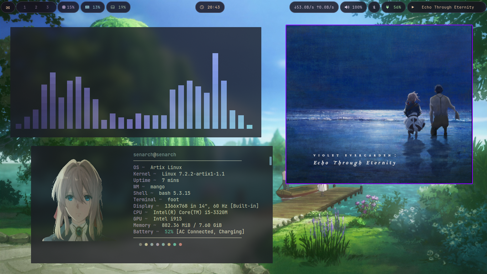
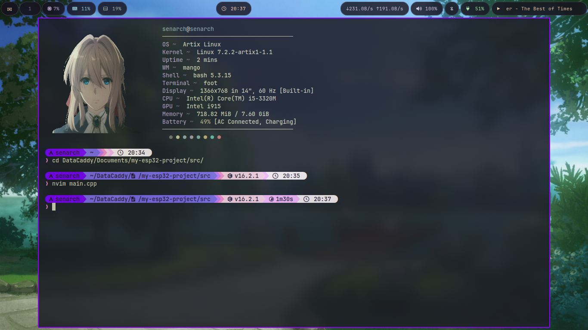
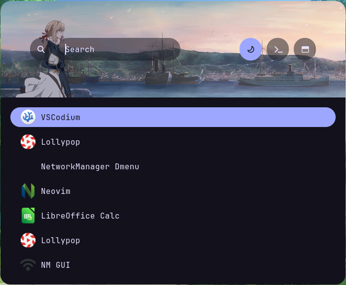
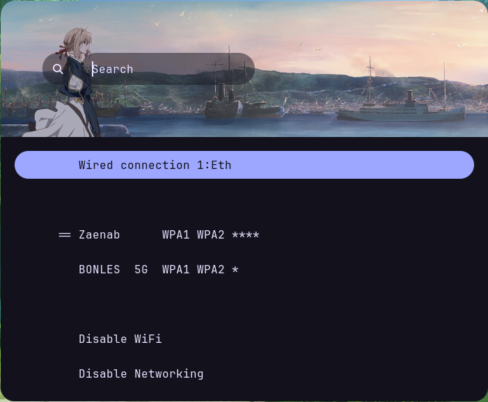
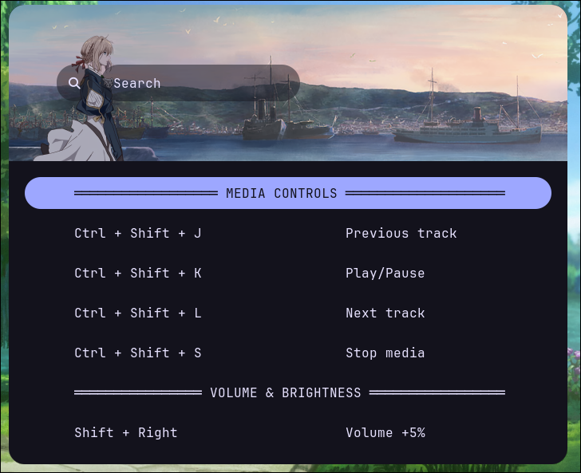

# Violet Rice 💜
 
A *Violet Evergarden* rice for Artix Linux (works in Arch too, or maybe in other disto), running on MangoWM (Wayland). 

---
<p align="center">
  
</p>

---

## About

This rice mixes the soft and elegant colors of *Violet Evergarden*. 

---

## Highlights
- 💻 **Custom Starship prompt** — a hand-picked gradient that flows from teal, to sky blue, to violet, to pink.
- 🎵 **Cava visualizer** — the audio bars use the same gradient as the rest of the rice.
- 🪫 **Runs on old hardware** — this whole setup is smooth on a 2012 laptop Lenovo G480 (Intel i5-3320M, 8GB RAM, SSD).

---

## Screenshots
<details>
<summary>🏡Home</summary>

</details>

<details>
<summary>👣Foot</summary>

</details>

<details>
<summary>💌Menu</summary>
<br>

**📬 Rofi**
<<br>

  
---
**🛜 Wifi**
<br>

</details>

---
**📄 Keybinds Cheat sheets**
<br>

</details>

<details>
<summary>🔐SDDM Login</summary>

</details>

<details>
<summary>💘GRUB Boot Menu</summary>

</details>

<details>
<summary>⚡Power Menu</summary>

</details>

<details>
<summary>🔑Swaylock</summary>

</details>

<details>
<summary>🔔Mako Notifications</summary>

</details>

---

## Specs

|                         |             |
| :---                    | :---        |
| **OS**                  | Artix Linux |
| **Window Manager**      | MangoWM     |
| **Bar**                 | Waybar      |
| **Terminal**            | Foot        |
| **Shell Prompt**        | Starship    |
| **App Launcher**        | Rofi        |
| **Notification Daemon** | Mako        |
| **Display Manager**     | SDDM        |
| **Music Visualizer**    | Cava        |

---

## Installation

There is no install script yet, so setup is manual for now.

### 1. Install the packages

Most of these are in the official Artix repos. A few, like `mango`, may need an AUR helper such as `yay` or `paru`.

```bash
# Install packages from official repos
sudo pacman -S --needed waybar rofi foot mako swaylock cava starship grub imagemagick p7zip ttf-jetbrains-mono-nerd ttf-firacode-nerd noto-fonts noto-fonts-cjk noto-fonts-emoji noto-fonts-extra pipewire pipewire-alsa pipewire-pulse wireplumber pamixer pavucontrol networkmanager networkmanager-dinit network-manager-applet nm-connection-editor tlp thermald thermald-dinit tlp-dinit grim slurp wf-recorder wl-clipboard cliphist wl-clip-persist jq ripgrep fd fzf git xdg-desktop-portal-wlr polkit-gnome thunar tumbler gvfs sddm sddm-dinit wlogout

# Install packages from AUR
paru -S --needed mangowm-git scenefx0.5 swaylock-effects-git swayosd-git wlr-dpms-git rofi-emoji-git ttf-google-fonts-typewolf ttf-ms-fonts

```

*Package names can be different depending on your repos — check before you install.*

### 2. Install Fonts (Required)
To ensure icons and symbols render correctly, make sure you have a Nerd Font installed. The following fonts are recommended:
```bash
sudo pacman -S ttf-jetbrains-mono-nerd ttf-firacode-nerd
paru -S ttf-google-fonts-typewolf ttf-ms-fonts
```

### 3. Copy the `.config` folder

This mirrors your real `~/.config/`, so one copy handles almost everything:

```bash
cp -r .config/. ~/.config/
```

### 4. Set up wlogout

```bash
sudo cp -r wlogout/etc/wlogout /etc/wlogout
sudo cp -r wlogout/usr/share/wlogout /usr/share/wlogout
```

### 5. Set up the GRUB theme

```bash
sudo cp -r grub-theme /boot/grub/themes/violetgrub
```

Open `/etc/default/grub` and set:

```
GRUB_THEME="/boot/grub/themes/violetgrub/theme.txt"
```

Then update GRUB:

```bash
sudo grub-mkconfig -o /boot/grub/grub.cfg
```

### 5. Set up SDDM

```bash
sudo cp -r sddm-theme /usr/share/sddm/themes/violet-sddm
sudo cp etc-configs/sddm.conf.d/theme.conf /etc/sddm.conf.d/
```

### 6. Turn on Starship

Add this line to the end of `~/.bashrc`:

```bash
eval "$(starship init bash)"
```

### 7. Reload

Log out and back in (or reboot) so everything loads together.

## 🎯 Optional Packages

```bash
# Development Tools
lazygit
neovim
vim

# Applications (personal preference)
qbittorrent
mpv
libreoffice-fresh
flatpak
vscodium-bin

# Hardware Specific
broadcom-bt-firmware-git 
bluez
bluez-utils
blueman
```

## Notes

- This was built and tested on my own laptop, so some paths and sizes may need small changes for your screen.
- If any icon shows up as a box instead of a symbol, your terminal font is probably not a Nerd Font. Make sure it's set to something like `JetBrainsMono Nerd Font`, not plain `JetBrains Mono`.
- The wallpapers here are already resized and compressed for normal use. If you want the full-resolution originals, keep your own copy — they aren't in this repo.

## Inspiration

- The SDDM theme (`sddm-theme/`) is based on the **meloworld-sddm** theme from [melatonia/meloworld-dotfiles](https://github.com/melatonia/meloworld-dotfiles) (MIT license). Big thanks — I mostly swapped the background, colors, and font.
- The wlogout icons come from [onlinewebfonts](https://www.onlinewebfonts.com/) (CC 3.0) — see `wlogout/usr/share/wlogout/assets/CREDIT.md` for the exact links.
<!-- add any other rices/configs that inspired this one here -->

## Credits

Made with 💜, by [@Whoscent](https://github.com/Whoscent)
