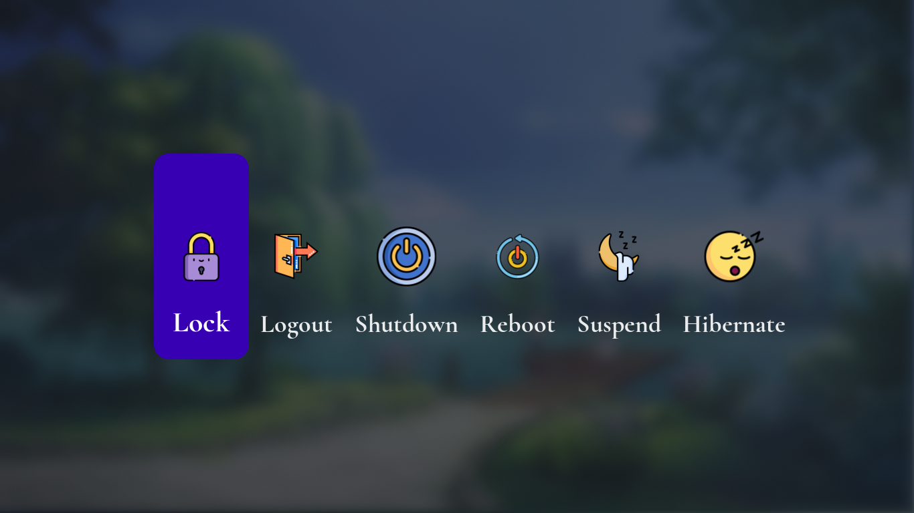
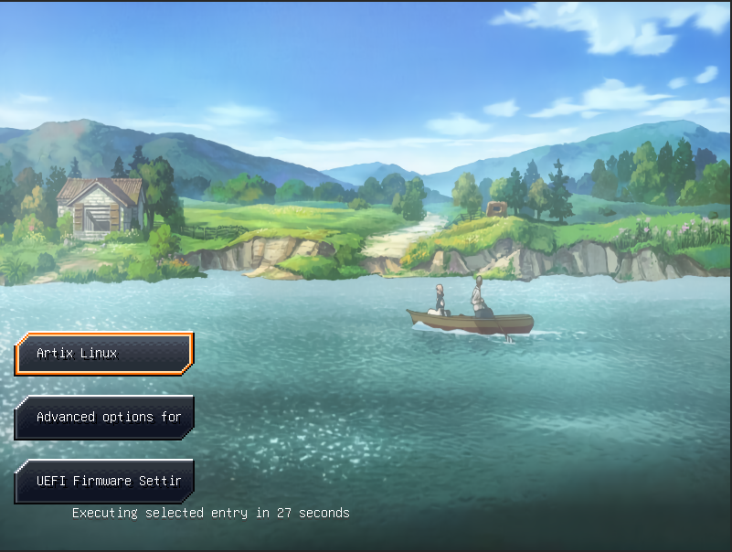
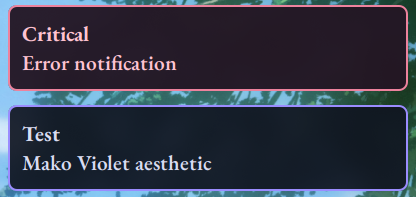

<div align="center">

# 🌸 violet-rice

> *A seamless blend of scenic nature and a clean, violet-pastel terminal setup.*


**Artix Linux** • **MangoWM** • **Foot** • **Starship**

</div>

---

## ✨ About

This rice mixes the soft, elegant colors of *Violet Evergarden* with the warm tones of the Kanagawa Wave palette. The same colors are used everywhere: terminal, notifications, boot menu, login screen, and lock screen. Nothing here feels like a separate app with its own random theme — it's all one look


## 🧩 My Setup

|                         |             |
| :---                    | :---        |
| **OS**                  | Artix Linux |
| **Window Manager**      | MangoWM     |
| **Bar**                 | Waybar      |
| **Terminal**            | Foot        |
| **Shell Prompt**        | Starship    |
| **App Launcher**        | Rofi        |
| **Notification Daemon** | Mako        |
| **Display Manager**     | SDDM        |
| **Music Visualizer**    | Cava        |
| **File Manager**        | Thunar      |
| **Text Editor**         | Neovim      |

## 🔤 Fonts
Pastikan font berikut terinstall di sistemmu agar simbol dan tampilan teks terlihat sempurna:
- `JetBrainsMono Nerd Font`
- `Cormorant Garamond`
- `EB Garamond`

---

<details>
<summary>🖼️ <b>Gallery</b></summary>

<br>

|  |  |
|:---:|:---:|
| **Desktop Overview (Waybar & Wallpaper)** | **Terminal & Starship Prompt** |

|  |  |
|:---:|:---:|
| **Media & Cava Visualizer** | **Rofi App Launcher** |

|  |  |
|:---:|:---:|
| **NetworkManager** | **SDDM Login Screen** |

|  |  |
|:---:|:---:|
| **Swaylock Screen** | **Wlogout Menu** |

|  |  |
|:---:|:---:|
| **GRUB Theme** | **Mako Notifications** |

</details>

---

<details>
<summary>🚀 <b>Instalasi (Klik untuk melihat)</b></summary>

<br>

> ⚠️ **Peringatan:** Repo ini adalah konfigurasi personal. Pastikan kamu sudah membackup config lama kamu sebelum mengoverwrite. Tidak ada `install.sh` otomatis, jadi kita akan melakukannya manual.

### 1. Install Dependencies
Install semua aplikasi yang dibutuhkan. Jika kamu menggunakan Artix Linux (pacman), jalankan:
```bash
sudo pacman -S mangowm foot starship waybar rofi mako sddm cava thunar neovim
```
*Catatan: Untuk MangoWM, pastikan kamu install dari AUR atau compile dari source sesuai panduan resminya.*

### 2. Install Fonts
Jangan lupa install font yang dibutuhkan:
```bash
sudo pacman -S ttf-jetbrains-mono-nerd
# Untuk EB Garamond dan Cormorant Garamond, cari di AUR atau unduh manual
```

### 3. Clone Repository
```bash
git clone https://github.com/Senarch/violet-rice.git
cd violet-rice
```

### 4. Copy Konfigurasi
Pindahkan folder konfigurasi ke direktori `~/.config/` di sistemmu. Contoh untuk beberapa aplikasi utama:
```bash
# Contoh copy MangoWM, Waybar, Foot, Starship, dll
cp -r mangowm ~/.config/
cp -r waybar ~/.config/
cp -r foot ~/.config/
cp -r starship ~/.config/
cp -r rofi ~/.config/
cp -r mako ~/.config/
cp -r cava ~/.config/
```

### 5. Setup GRUB Theme
- Copy folder theme ke `/boot/grub/themes/`
- Edit file `/etc/default/grub` dan tambahkan: `GRUB_THEME="/boot/grub/themes/violet-rice/theme.txt"`
- Update GRUB:
```bash
sudo grub-mkconfig -o /boot/grub/grub.cfg
```

### 6. Restart Service
Restart service yang berjalan di background agar config baru terbaca, atau bisa juga langsung *reboot* PC kamu:
```bash
systemctl --user restart waybar mako
```

</details>

---

<div align="center">

## 💜 Credits & Thanks

Dibuat dengan ❤️ oleh **[Senarch](https://github.com/Senn309662)**.
Terima kasih kepada komunitas r/unixporn dan pembuat aplikasi *open-source* yang luar biasa!

Jika kamu suka dengan *rice* ini, jangan lupa kasih ⭐ di repository ini!

</div>

***
