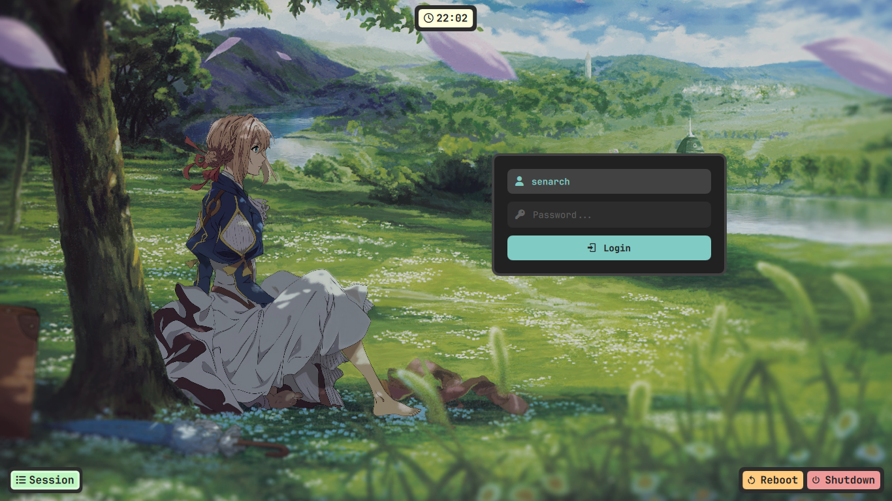

# Violet Rice 🎨

A *Violet Evergarden* × Kanagawa Wave rice for Artix Linux, running on MangoWM (Wayland).

<p align="center">
  
</p>

## About

This rice mixes the soft, elegant colors of *Violet Evergarden* with the warm tones of the Kanagawa Wave palette. The same colors and fonts are used everywhere: terminal, notifications, boot menu, login screen, and lock screen. Nothing here feels like a separate app with its own random theme — it's all one look.

## Highlights

- 🎨 **One theme, everywhere** — the same palette and fonts follow you from the terminal to the boot screen.
- 🚀 **Custom GRUB theme** — a full landscape background with a styled boot menu, not just a wallpaper swap.
- 💻 **Custom Starship prompt** — a hand-picked gradient that flows from teal, to sky blue, to violet, to pink.
- 🔓 **Transparent wlogout** — the power menu shows the wallpaper through it instead of a plain background.
- 🎵 **Cava visualizer** — the audio bars use the same gradient as the rest of the rice.
- 🪫 **Runs on old hardware** — this whole setup is smooth on a 2012 laptop (Intel i5-3320M, 1366x768 screen).

## Screenshots

<details>
<summary>Desktop & Waybar</summary>

</details>

<details>
<summary>Rofi</summary>

</details>

<details>
<summary>SDDM Login</summary>

</details>

<details>
<summary>GRUB Boot Menu</summary>

</details>

<details>
<summary>Wlogout</summary>

</details>

<details>
<summary>Swaylock</summary>

</details>

<details>
<summary>Mako Notifications</summary>

</details>

## Specs

|                         |             |
| :---                    | :---        |
| **OS**                  | Artix Linux |
| **Window Manager**      | MangoWM     |
| **Bar**                 | Waybar      |
| **Terminal**            | Foot        |
| **Shell Prompt**        | Starship    |
| **App Launcher**        | Rofi        |
| **Notification Daemon** | Mako        |
| **Display Manager**     | SDDM        |
| **Music Visualizer**    | Cava        |
| **File Manager**        | Thunar      |
| **Text Editor**         | Neovim      |


## Installation

There is no install script yet, so setup is manual for now.

### 1. Install the packages

Most of these are in the official Artix repos. A few, like `mango`, may need an AUR helper such as `yay`.

```bash
sudo pacman -S --needed waybar rofi foot mako swaylock cava starship grub imagemagick p7zip
yay -S --needed mango
```

*Package names can be different depending on your repos — check before you install.*

### 2. Copy the `.config` folder

This mirrors your real `~/.config/`, so one copy handles almost everything:

```bash
cp -r .config/. ~/.config/
```

### 3. Set up wlogout

```bash
sudo cp -r wlogout/etc/wlogout /etc/wlogout
sudo cp -r wlogout/usr/share/wlogout /usr/share/wlogout
```

### 4. Set up the GRUB theme

```bash
sudo cp -r grub-theme /boot/grub/themes/violetgrub
```

Open `/etc/default/grub` and set:

```
GRUB_THEME="/boot/grub/themes/violetgrub/theme.txt"
```

Then update GRUB:

```bash
sudo grub-mkconfig -o /boot/grub/grub.cfg
```

### 5. Set up SDDM

```bash
sudo cp -r sddm-theme /usr/share/sddm/themes/violet-sddm
sudo cp etc-configs/sddm.conf.d/theme.conf /etc/sddm.conf.d/
```

### 6. Turn on Starship

Add this line to the end of `~/.bashrc`:

```bash
eval "$(starship init bash)"
```

### 7. Reload

Log out and back in (or reboot) so everything loads together.

## Notes

- This was built and tested on my own laptop, so some paths and sizes may need small changes for your screen.
- If any icon shows up as a box instead of a symbol, your terminal font is probably not a Nerd Font. Make sure it's set to something like `JetBrainsMono Nerd Font`, not plain `JetBrains Mono`.
- The wallpapers here are already resized and compressed for normal use. If you want the full-resolution originals, keep your own copy — they aren't in this repo.

## Inspiration

- The SDDM theme (`sddm-theme/`) is based on the **meloworld-sddm** theme from [melatonia/meloworld-dotfiles](https://github.com/melatonia/meloworld-dotfiles) (MIT license). Big thanks — I mostly swapped the background, colors, and font.
- The wlogout icons come from [onlinewebfonts](https://www.onlinewebfonts.com/) (CC 3.0) — see `wlogout/usr/share/wlogout/assets/CREDIT.md` for the exact links.
<!-- add any other rices/configs that inspired this one here -->

## Credits

Made by [@Whosent](https://github.com/Whosent)
